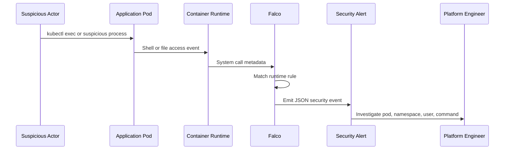
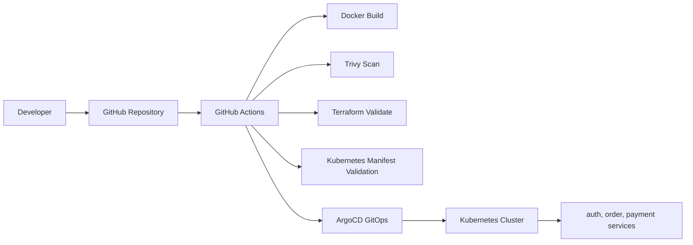

# Enterprise Secure Kubernetes Platform

[](https://github.com/AssassinSaurabh/enterprise-devsecops-platform/actions/workflows/platform-ci.yaml)
[](https://github.com/AssassinSaurabh/enterprise-devsecops-platform/actions/workflows/security.yaml)

## Hero Banner


**Enterprise Secure Kubernetes Platform** is a DevSecOps portfolio project that combines Kubernetes, GitHub Actions, GitOps, runtime security, policy-as-code, observability, and AWS production architecture design.

## Project Overview

This project demonstrates how a DevSecOps engineer designs and operates a secure Kubernetes platform.

The platform includes:

- Three microservices: `auth-service`, `order-service`, and `payment-service`
- Kubernetes deployments, services, ingress, namespaces, and monitoring resources
- GitHub Actions for CI validation and security scanning
- ArgoCD for GitOps-style delivery
- Prometheus, Grafana, and Alertmanager for observability
- Falco for runtime threat detection
- OPA Gatekeeper for admission control
- Terraform modules for AWS production architecture

In simple words, this project shows what happens from code commit to secure Kubernetes operation:

1. Code is pushed to GitHub.
2. GitHub Actions validates the platform.
3. ArgoCD syncs Kubernetes manifests.
4. OPA Gatekeeper checks workloads before they run.
5. Prometheus watches health and resource signals.
6. Falco watches runtime container behavior.
7. Terraform describes the AWS production platform.

<details>
<summary>Simple explanation for beginners</summary>

Think of this as a secure application factory:

- GitHub stores the blueprint.
- GitHub Actions checks the blueprint before use.
- ArgoCD sends the blueprint to Kubernetes.
- Kubernetes runs the application.
- OPA Gatekeeper blocks unsafe workloads at the door.
- Falco watches containers after they start.
- Prometheus and Grafana show health and performance.
- Alertmanager sends alerts when something needs attention.
- Terraform describes how the same platform maps to AWS.

</details>

## Architecture Diagram


The local architecture shows the core delivery flow:

- Developer pushes to GitHub.
- GitHub Actions validates Docker, Trivy, Terraform, and Kubernetes manifests.
- ArgoCD represents GitOps delivery.
- The Kubernetes cluster runs the three application services.

## Security Architecture


Security is applied in multiple layers:

- **Before deployment:** GitHub Actions runs Docker build, Trivy scan, Terraform validation, and Kubernetes manifest validation.
- **During deployment:** OPA Gatekeeper validates workloads through Kubernetes admission control.
- **After deployment:** Falco detects suspicious runtime behavior inside containers.
- **During operations:** Prometheus, Grafana, and Alertmanager provide visibility and alerting.

## Observability Architecture


Observability is built around Prometheus and Grafana:

- Application services expose metrics.
- Prometheus collects and stores metrics.
- Alertmanager routes alerts.
- Grafana provides dashboards.
- Engineers monitor CPU, memory, restarts, and CrashLoopBackOff events.

## AWS Production Architecture


The AWS production reference architecture maps the platform to cloud-native AWS services:

- AWS WAF protects traffic before it reaches the application layer.
- Application Load Balancer routes external traffic.
- Amazon EKS hosts Kubernetes workloads.
- Worker nodes run across private subnets.
- OPA Gatekeeper and Falco provide Kubernetes security controls.
- Prometheus, Grafana, and Alertmanager provide observability.
- GuardDuty, Security Hub, and CloudTrail provide AWS security visibility.
- Terraform modules define the AWS infrastructure.

## Runtime Threat Detection Workflow



Falco detections included in this project:

- Shell spawned inside application container
- Sensitive file read inside application container
- Package manager started inside application container

## CI/CD Pipeline



GitHub Actions workflows:

- `Platform CI`
- `Security Scan`

Both workflows run on push and pull request.

## Key Features

- Multi-service Kubernetes application
- GitHub Actions CI validation
- Trivy filesystem security scanning
- ArgoCD GitOps workflow
- Prometheus service discovery with ServiceMonitor
- Alertmanager alert routing
- PrometheusRule alerts for workload health
- Falco runtime threat detection
- OPA Gatekeeper admission control
- Terraform AWS platform modules
- Professional architecture documentation

## Technology Stack

| Area | Tools |
| --- | --- |
| Application | Python, Flask |
| Containers | Docker |
| Kubernetes | Kind, Kubernetes manifests, Ingress |
| GitOps | ArgoCD |
| CI/CD | GitHub Actions |
| Security Scanning | Trivy |
| Runtime Security | Falco |
| Policy as Code | OPA Gatekeeper, Rego |
| Monitoring | Prometheus, Grafana, Alertmanager |
| Cloud Design | Terraform, AWS VPC, EKS, WAF, GuardDuty, Security Hub, CloudTrail |

## Repository Structure

```text
app/
  auth-service/
  order-service/
  payment-service/

argocd/
  auth-app.yaml

kubernetes/
  auth/
  order/
  payment/
  monitoring/
  namespaces/
  ingress.yaml
  kustomization.yaml

security/
  falco/
  opa/gatekeeper/

terraform/
  modules/
  environments/prod-design/

docs/
  architecture.md
  roadmap.md
  images/
  runbooks/

.github/workflows/
  platform-ci.yaml
  security.yaml
```

## Getting Started

Clone the repository:

```bash
git clone git@github.com:AssassinSaurabh/enterprise-devsecops-platform.git
cd enterprise-devsecops-platform
```

Validate Kubernetes manifests:

```bash
kubectl kustomize kubernetes
```

Validate OPA Gatekeeper policies:

```bash
kubectl kustomize security/opa/gatekeeper
```

Validate Terraform:

```bash
terraform -chdir=terraform/environments/prod-design init -backend=false
terraform -chdir=terraform/environments/prod-design validate
```

Build service images:

```bash
docker build -t auth-service ./app/auth-service
docker build -t order-service ./app/order-service
docker build -t payment-service ./app/payment-service
```

Run the security scan:

```bash
trivy fs --db-repository public.ecr.aws/aquasecurity/trivy-db:2 --severity HIGH,CRITICAL --ignore-unfixed --exit-code 1 .
```

## Security Controls

### CI Security

- Trivy scans the repository for high and critical findings.
- Docker builds verify service container buildability.
- Kubernetes manifests are rendered before merge.
- Terraform configuration is formatted and validated.

### Admission Security

OPA Gatekeeper policies enforce:

- Required CPU and memory requests/limits in `dev`
- Denial of privileged pods in `dev`
- Namespace label governance in dry-run mode

### Runtime Security

Falco detects:

- Interactive shell execution
- Sensitive file access
- Package manager execution inside application containers

## Monitoring & Alerting

Prometheus alert rules cover:

- High CPU usage
- High memory usage
- CrashLoopBackOff
- Frequent container restarts

Alertmanager groups and routes alert events. Grafana provides dashboard visualization.

## Documentation

- [Architecture](docs/architecture.md)
- [Delivery Roadmap](docs/roadmap.md)
- [Falco Runtime Security Runbook](docs/runbooks/falco-runtime-security.md)
- [Terraform AWS Design](terraform/README.md)

## Project Status

The platform is complete as a DevSecOps portfolio project:

- Application platform complete
- CI/CD validation complete
- Runtime security complete
- Policy-as-code complete
- Observability and alerting complete
- AWS production architecture design complete
