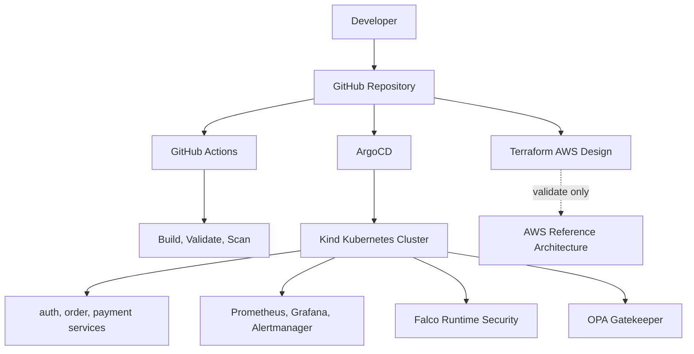
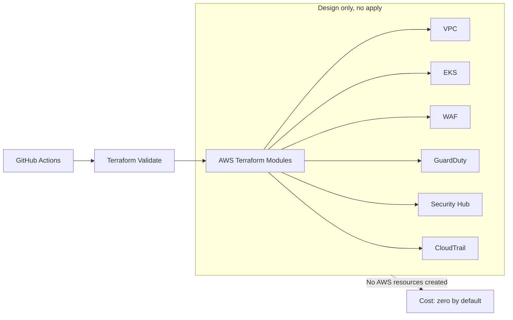
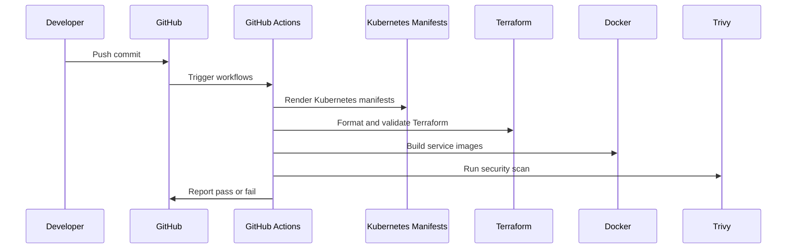

# Enterprise Secure Kubernetes Platform

[](https://github.com/AssassinSaurabh/enterprise-devsecops-platform/actions/workflows/platform-ci.yaml)
[](https://github.com/AssassinSaurabh/enterprise-devsecops-platform/actions/workflows/security.yaml)

## What This Project Is

This is a DevSecOps portfolio platform that shows how a secure Kubernetes platform would be built, monitored, scanned, governed, and designed for AWS.

It runs locally using Docker and Kind, so it does not create AWS bills. The AWS side is represented with Terraform modules that are validated but not applied.

Project title:

**Enterprise Secure Kubernetes Platform on AWS with Automated Threat Detection and Incident Response**

## Baby Explanation

Imagine this project as a secure office building:

- The apps are the rooms where work happens.
- Kubernetes is the building manager that keeps rooms running.
- GitHub Actions is the security checkpoint before anything enters the building.
- ArgoCD is the person who keeps the building matching the official blueprint.
- Prometheus watches health signals like CPU, memory, crashes, and restarts.
- Alertmanager decides how alerts should be grouped and routed.
- Falco is the security camera watching what containers do at runtime.
- OPA Gatekeeper is the front-door guard that blocks unsafe Kubernetes objects.
- Terraform is the AWS blueprint, but it is not used to build real AWS resources unless someone intentionally chooses to do that later.

## What It Actually Does

The repository contains:

- Three Python Flask microservices: auth, order, and payment.
- Kubernetes manifests for deployments, services, ingress, namespaces, and monitoring.
- Prometheus Operator resources for service discovery and alerting.
- Falco configuration for runtime threat detection.
- OPA Gatekeeper policies for admission control.
- Terraform modules for production-style AWS architecture design.
- GitHub Actions workflows for CI and security scanning.
- Professional architecture documentation and diagrams.

<details>
<summary>Click to see the platform in one sentence</summary>

Code is pushed to GitHub, GitHub Actions validates it, ArgoCD represents GitOps delivery to Kubernetes, Prometheus monitors it, Alertmanager routes alerts, Falco detects runtime threats, OPA Gatekeeper blocks unsafe workloads, and Terraform documents the AWS production design without creating cloud resources.

</details>

## High-Level Architecture



## How AWS Fits In



The Terraform code models what would exist in AWS:

- VPC networking
- Private and public subnets
- EKS cluster and node group
- WAF managed rules
- GuardDuty threat detection
- Security Hub compliance aggregation
- CloudTrail audit logging

The project validates the design but does not run `terraform apply`.

## CI/CD Pipeline



Current workflows:

- `Platform CI`
- `Security Scan`

Both workflows are expected to pass on `main`.

## Runtime Security

Falco runs as a DaemonSet and watches container behavior across the local Kind nodes.

Custom detections include:

- Shell spawned inside application container
- Sensitive file read inside application container
- Package manager execution inside application container

These detections show how a cloud security engineer can identify suspicious runtime behavior after a container is already running.

<details>
<summary>Example Falco scenario</summary>

If someone opens a shell inside the `auth-service` container or reads `/etc/passwd`, Falco sees the system call, matches the custom runtime rule, and emits a JSON security alert containing the namespace, pod, container, user, command, and rule name.

</details>

## Policy as Code

OPA Gatekeeper is used for Kubernetes admission control.

Current policies:

- Deny pods in `dev` that do not define CPU and memory requests/limits.
- Deny privileged pods in `dev`.
- Audit namespace labels in dry-run mode.

This means unsafe workloads can be blocked before they run.

<details>
<summary>Example OPA Gatekeeper scenario</summary>

If someone tries to create a pod in the `dev` namespace without CPU and memory limits, Gatekeeper denies it at admission time. If someone tries to run a privileged pod in `dev`, Gatekeeper denies that too.

</details>

## Observability and Alerts

Prometheus collects metrics from the microservices and Kubernetes workloads.

Alert coverage:

- High CPU usage
- High memory usage
- CrashLoopBackOff
- Frequent container restarts

Alertmanager groups and routes alerts.

<details>
<summary>Example alert scenario</summary>

If a service starts crashing repeatedly, Kubernetes exposes restart and waiting-state metrics. Prometheus evaluates the alert rules, and Alertmanager groups the alert so an engineer can investigate the failing pod.

</details>

## Repository Structure

```text
app/                  Flask microservices
argocd/               ArgoCD application definition
kubernetes/           Kubernetes workloads, services, ingress, monitoring
security/falco/       Falco Helm values and custom runtime rules
security/opa/         OPA Gatekeeper policies and tests
terraform/            AWS design-only Terraform modules
docs/                 Professional architecture and roadmap docs
.github/workflows/    GitHub Actions CI and security workflows
```

## Local Validation Commands

Render Kubernetes:

```bash
kubectl kustomize kubernetes
```

Render Gatekeeper policies:

```bash
kubectl kustomize security/opa/gatekeeper
```

Validate Terraform:

```bash
terraform -chdir=terraform/environments/prod-design init -backend=false
terraform -chdir=terraform/environments/prod-design validate
```

Run security scan:

```bash
trivy fs --db-repository public.ecr.aws/aquasecurity/trivy-db:2 --severity HIGH,CRITICAL --ignore-unfixed --exit-code 1 .
```

## Documentation

- [Architecture](docs/architecture.md)
- [Delivery Roadmap](docs/roadmap.md)
- [Falco Runtime Security Runbook](docs/runbooks/falco-runtime-security.md)
- [Terraform AWS Design](terraform/README.md)

## Cost Control

This project is safe for a portfolio environment because:

- The local platform runs on Docker and Kind.
- Terraform is validated with `-backend=false`.
- AWS modules are design-only.
- No `terraform apply` is part of the normal workflow.

## Professional Summary

This project demonstrates practical DevSecOps engineering across application delivery, Kubernetes operations, runtime threat detection, policy-as-code, observability, CI security, and AWS platform design.
