# Architecture: Enterprise Secure Kubernetes Platform

## Executive Summary

This project is a DevSecOps platform reference implementation that demonstrates how a production-grade cloud security platform can be designed, validated, monitored, and governed.

The runnable environment uses Docker, Kind, Kubernetes, GitHub Actions, ArgoCD, Prometheus, Grafana, Alertmanager, Falco, Trivy, and OPA Gatekeeper. The AWS production layer is represented through Terraform modules for VPC, EKS, GuardDuty, Security Hub, CloudTrail, and WAF.

In simple terms:

- The application runs as three microservices on Kubernetes.
- GitHub Actions validates code, manifests, Terraform, Docker builds, and security scans.
- ArgoCD represents GitOps deployment.
- Prometheus and Alertmanager monitor application and workload health.
- Falco detects suspicious runtime behavior inside containers.
- OPA Gatekeeper blocks unsafe Kubernetes workloads before they enter the cluster.
- Terraform defines the AWS production architecture.

## Reference Diagram

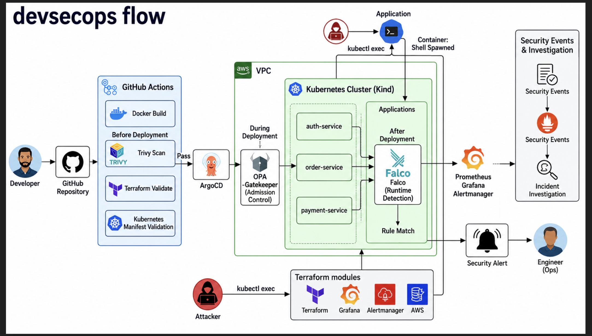

## System Context

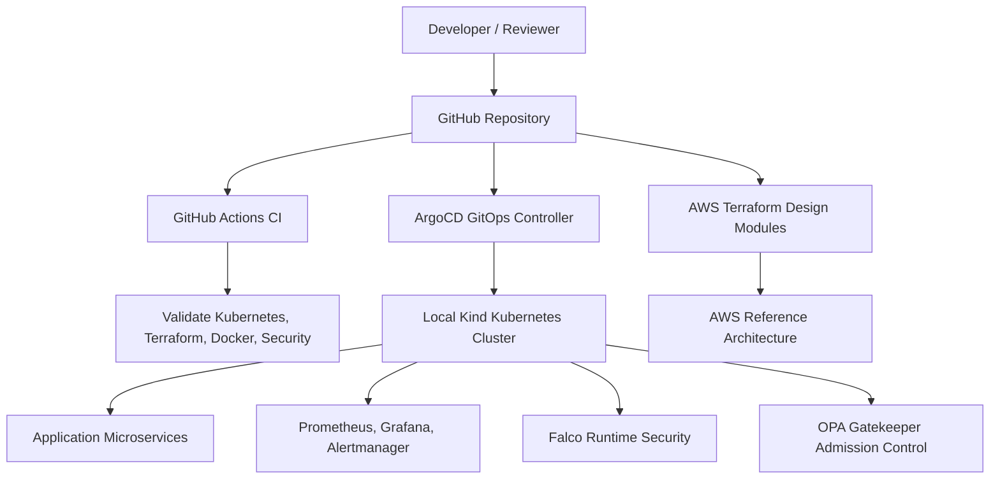

## Local Kubernetes Runtime

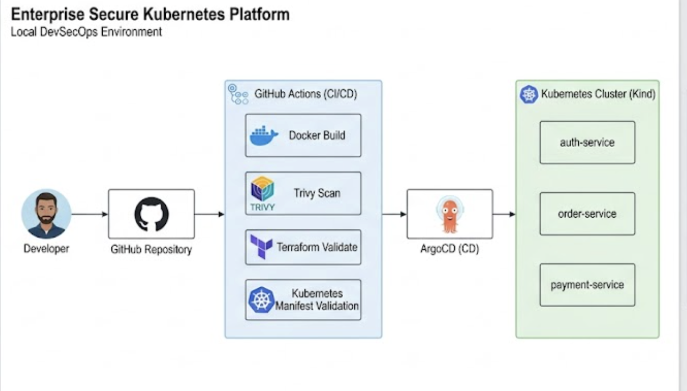

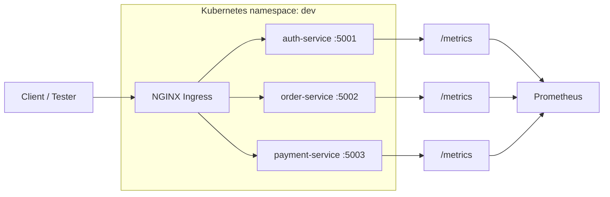

The application layer is intentionally simple so the platform engineering and security controls are easy to inspect. Each service exposes Prometheus metrics and runs with CPU and memory requests/limits so resource-based alerts and admission policies have meaningful data.

## CI/CD and GitOps Flow

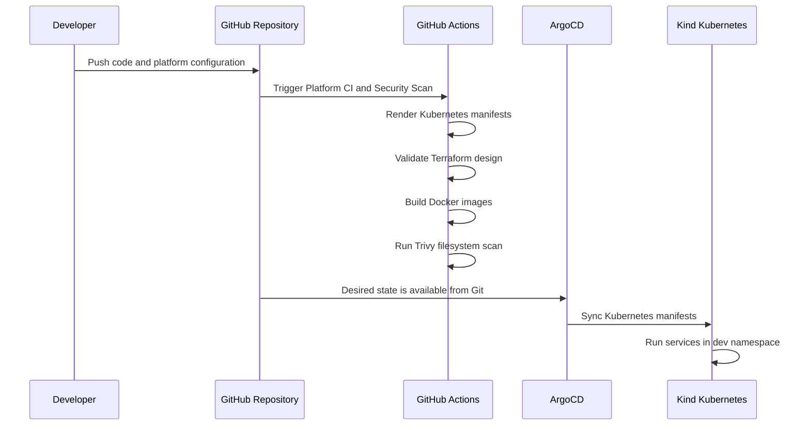

The project uses GitHub Actions as the quality gate. The pipeline does not deploy to AWS. It proves that the repository is buildable, scannable, and structurally valid before any deployment workflow would be considered.

## Security Architecture

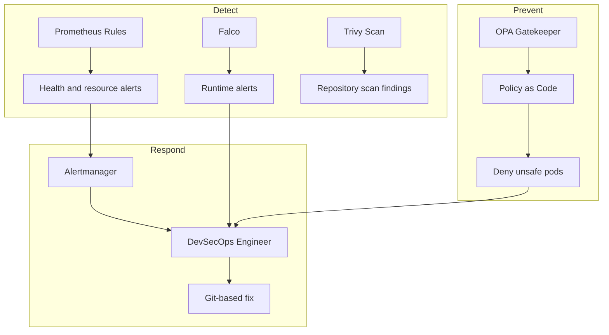

Security controls are layered:

- CI security: Trivy scans the repository.
- Admission security: OPA Gatekeeper blocks noncompliant pods in the `dev` namespace.
- Runtime security: Falco detects shell execution, sensitive file reads, and package manager execution inside application containers.
- Monitoring security: PrometheusRule resources detect CPU pressure, memory pressure, crash loops, and frequent restarts.

## Observability Flow

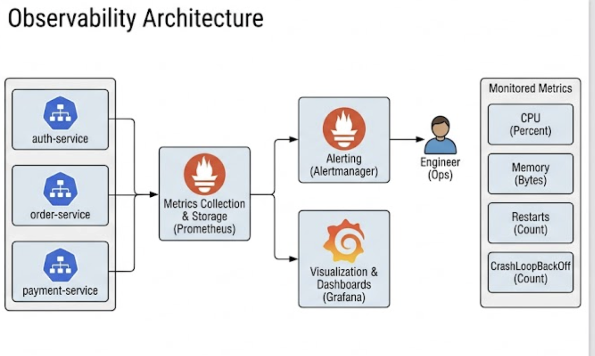

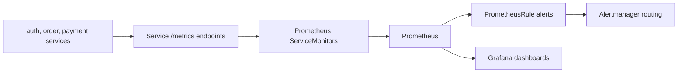

The monitoring stack is based on Prometheus Operator resources:

- `ServiceMonitor` discovers service metrics.
- `PrometheusRule` defines workload alerts.
- `AlertmanagerConfig` defines alert grouping and routing.

## Runtime Security Flow

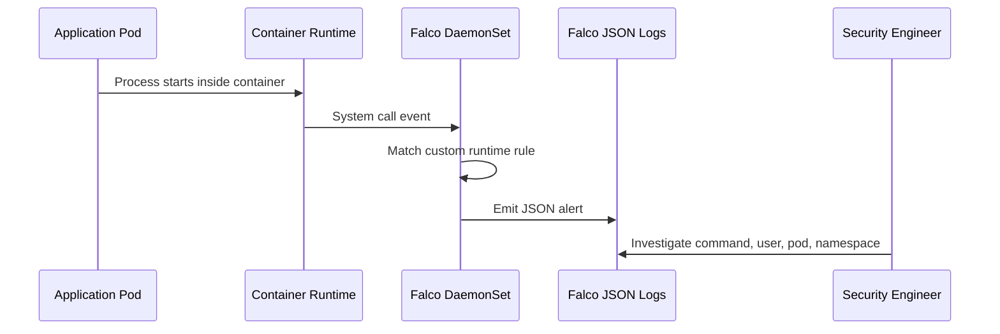

Falco runs as a DaemonSet so every node is monitored. The project includes custom rules for:

- Shell spawned inside application containers
- Sensitive file reads such as `/etc/passwd`
- Package manager execution inside application containers

## Admission Control Flow

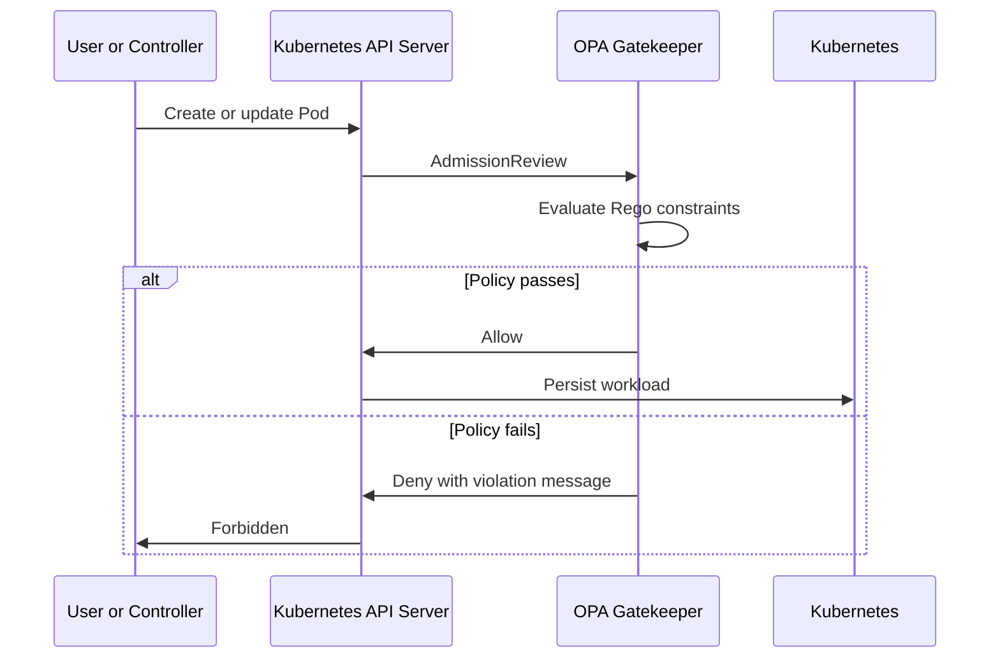

OPA Gatekeeper enforces two production-style controls in the `dev` namespace:

- Pods must define CPU and memory requests/limits.
- Pods must not run privileged containers.

Namespace labeling is configured in dry-run mode to show how audit-only governance can be introduced without breaking existing workloads.

## AWS Reference Architecture

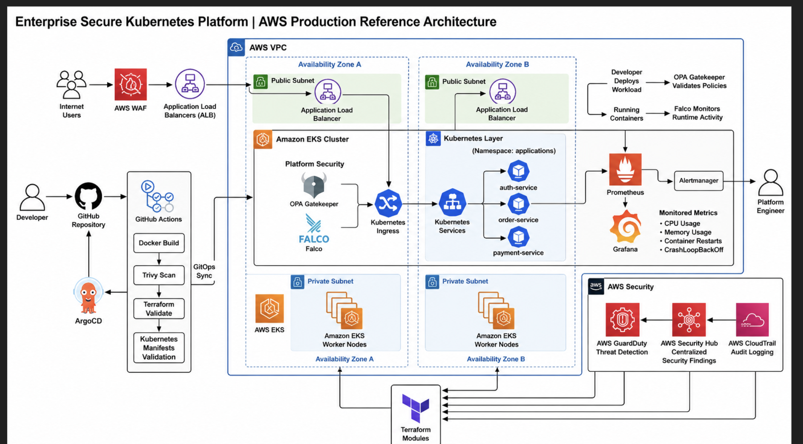

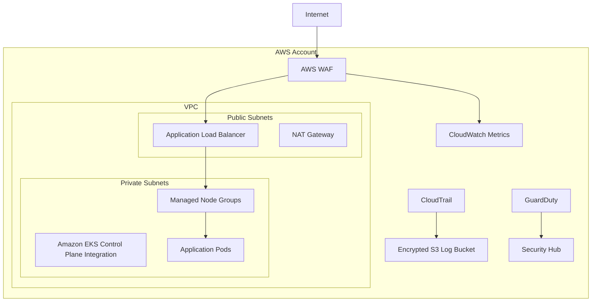

The AWS layer describes how the same platform maps to production cloud primitives. Terraform modules define the network, Kubernetes, perimeter protection, audit logging, threat detection, and security findings components.

Terraform modules:

- VPC networking
- EKS cluster and node group
- GuardDuty
- Security Hub
- CloudTrail
- WAFv2

## Incident Response Flow

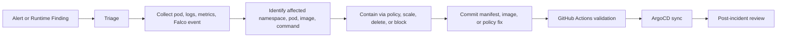

The platform is designed around Git-based remediation. Changes are made in code, validated in CI, and reconciled into the cluster through GitOps.

## What This Project Demonstrates

- Kubernetes platform engineering
- DevSecOps CI/CD design
- GitOps deployment patterns
- Prometheus-based monitoring and alerting
- Runtime threat detection with Falco
- Admission control with OPA Gatekeeper
- Secure AWS architecture design with Terraform
- Cloud security architecture discipline

## Production Readiness Notes

This reference implementation focuses on platform architecture, CI/CD validation, security controls, observability, and AWS infrastructure design. A production deployment would normally add image registry promotion, secrets management, identity federation, centralized logging, and incident-management integrations.
