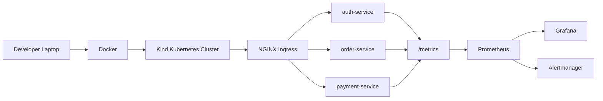
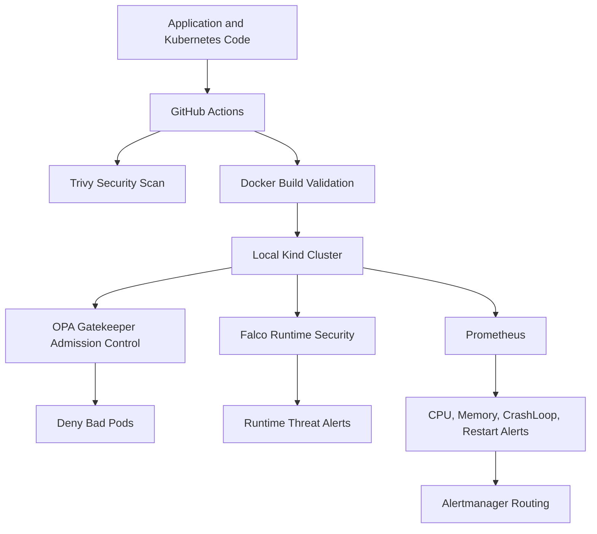
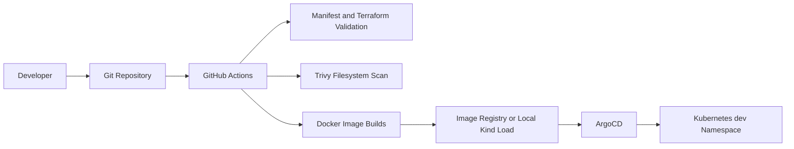
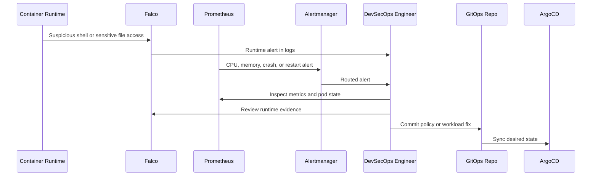
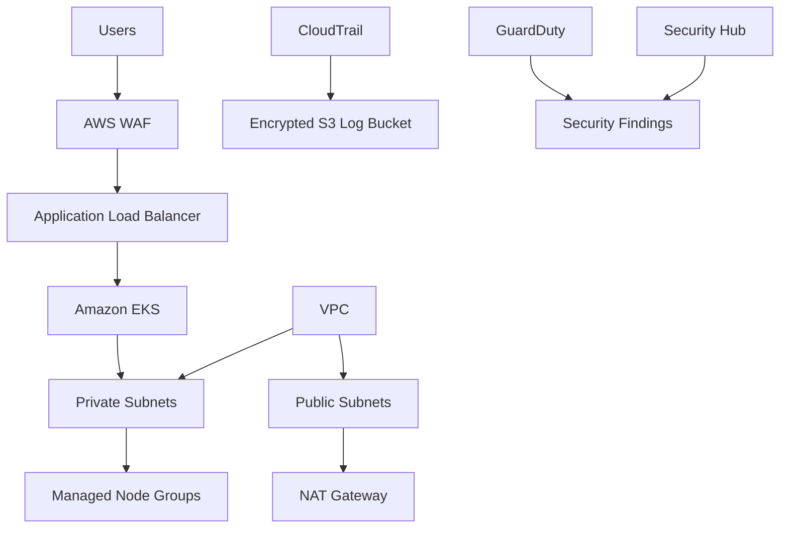

# Enterprise Secure Kubernetes Platform Architecture

Portfolio title:

**Enterprise Secure Kubernetes Platform on AWS with Automated Threat Detection and Incident Response**

## Network Diagram

## Security Diagram

## CI/CD Diagram

## Incident Response Diagram

## AWS Design-Only Architecture

## Cost Control

- Local implementation runs on Docker and Kind.
- AWS Terraform modules are design-only.
- Terraform validation is allowed.
- Terraform apply is not part of this project workflow.
- No AWS resources are created unless explicitly chosen later.
