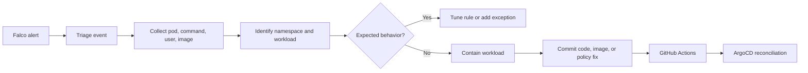

# Falco Runtime Security Runbook

## Purpose

This runbook explains how Falco is used in this project to detect suspicious runtime behavior inside Kubernetes containers.

Falco provides runtime visibility. While CI and admission control prevent known bad configurations before deployment, Falco watches what actually happens after workloads are running.

## What Falco Detects Here

The project includes custom detections for:

- Shell execution inside application containers
- Sensitive file reads inside application containers
- Package manager execution inside application containers

These signals are useful because production application containers normally should not need interactive shells, direct reads of sensitive Linux identity files, or package installation at runtime.

## Local Installation

Falco is installed with the official Helm chart and a local Kind values file:

```bash
helm repo add falcosecurity https://falcosecurity.github.io/charts
helm repo update falcosecurity
helm upgrade --install falco falcosecurity/falco \
  --namespace falco --create-namespace \
  --version 9.1.0 \
  -f security/falco/values-kind.yaml
```

## Verification

Check that Falco is running:

```bash
kubectl get pods -n falco
```

Expected result:

- One Falco pod per Kind node
- Each pod running the Falco container and the falcoctl sidecar

Check the metrics integration:

```bash
kubectl get servicemonitor -n falco
```

## Safe Demo Events

Trigger a shell execution detection:

```bash
kubectl exec -n dev deploy/auth-service -- sh -c 'echo falco-shell-demo'
```

Trigger a sensitive file read detection:

```bash
kubectl exec -n dev deploy/auth-service -- sh -c 'cat /etc/passwd >/dev/null'
```

View Falco alerts:

```bash
kubectl logs -n falco -l app.kubernetes.io/name=falco -c falco --since=5m
```

## Expected Alert Fields

Falco emits JSON alerts containing fields such as:

- Rule name
- Priority
- Namespace
- Pod name
- Container name
- Container image
- User
- Command line
- File name, when relevant

## Response Workflow



## Production Notes

In a production deployment, Falco events would normally be forwarded to a central logging or alerting path such as:

- Falcosidekick
- SIEM
- Slack or incident platform
- Cloud logging service

This project keeps output local and simple for cost control and portfolio reproducibility.
